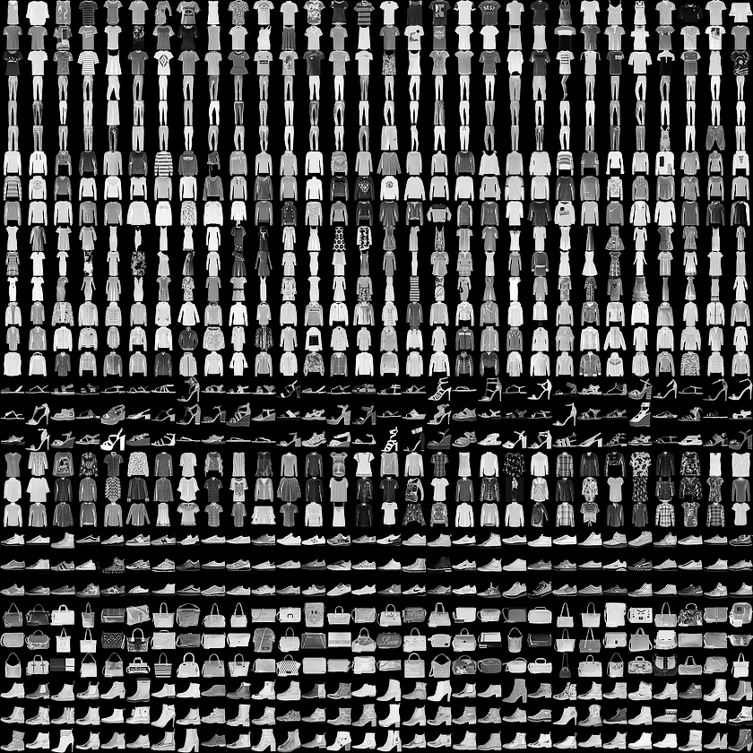

# Docker File Information

I write a DockerFile that helps you creating a Docker image that you can run ipython notebooks. With this image, you can train CNN models and test models to classify Fashion-MNIST data

This Dockerfile simply clones a Github repository which has the code.

### How to run the app?

##### Requirements
You need [Docker](https://www.docker.com/) installed in your pc. 

1. Clone the repository with the following command:
```
git clone https://github.com/cemalaytekin/Fashion-Mnist-With-Keras.git
```

2. Go to the project directory
```
cd Fashion-Mnist-With-Keras
```

3. Now we can build a new docker image based on Ubuntu 16.04 and our dockerfile with the docker command below:
```
docker build --tag=fmnist .
```

4. Run docker image on port 8888
```
docker run -d -v /$(pwd)/:/home/jovyan/work -p 8888:8888 fmnist start-notebook.sh --NotebookApp.token=''  
```

5. Open browser and write:
```
localhost:8888/?token=
```
where is the token appeared on terminal.


# Fashion-Mnist-With-Keras
Fashion-MNIST is a dataset of Zalando's article images—consisting of a training set of 60,000 examples and a test set of 10,000 examples. Each example is a 28x28 grayscale image, associated with a label from 10 classes. We intend Fashion-MNIST to serve as a direct drop-in replacement for the original MNIST dataset for benchmarking machine learning algorithms. It shares the same image size and structure of training and testing splits.

Here's an example how the data looks (each class takes three-rows):



### Labels
Each training and test example is assigned to one of the following labels:

| Label | Description |
| --- | --- |
| 0 | T-shirt/top |
| 1 | Trouser |
| 2 | Pullover |
| 3 | Dress |
| 4 | Coat |
| 5 | Sandal |
| 6 | Shirt |
| 7 | Sneaker |
| 8 | Bag |
| 9 | Ankle boot |

### Conclusions

With a complex sequential model with multiple convolution layers and 50 epochs for the training, we obtained an accuracy ~0.91 for test prediction. After investigating the validation accuracy and loss, we understood that the model is overfitting.
We retrained the model with Dropout layers to the model to reduce overfitting.
We confirmed the model improvement and with the same number of epochs for the training we obtained with the new model an accuracy of ~0.92 for test prediction. Only few classes are not correctly classified all the time, especially Class 6 (Shirt) and Class 2 (Pullover).

### References
[Fashion MNIST | Kaggle](https://www.kaggle.com/zalando-research/fashionmnist)

[Fashion_MNIST | zalando](https://github.com/zalandoresearch/fashion-mnist)
